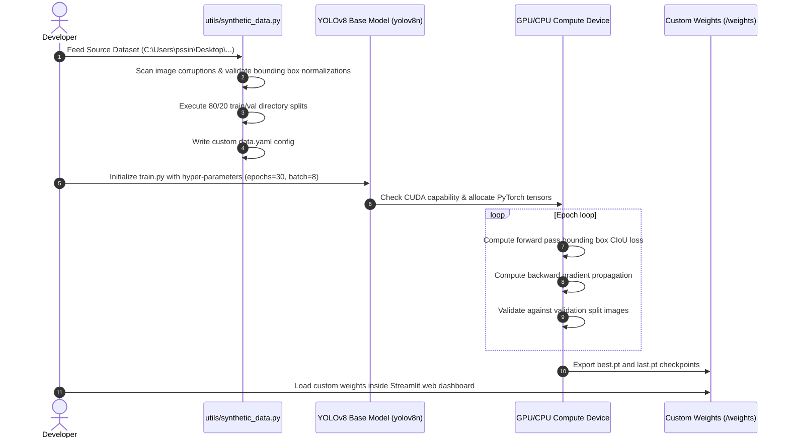

# System Diagrams & Architectural Flowcharts

This document houses the Mermaid diagrams representing the architectural pipelines, training schedules, and database layouts for the **Number Plate & Vehicles Detection (Multiple Custom Objects Detection)** project.

---

## 1. System Architecture Diagram

```mermaid
graph TD
    A[Input Traffic Source: Image / Video / Webcam] --> B[YOLOv8 Multi-Object Localization]
    B --> C[Extract Object Classes]
    
    C -->|Car, Truck, Bus, Bike| D[Overlay Class Box & Confidence]
    C -->|Pedestrian/Person| E[Overlay Pedestrian Bounding Box]
    C -->|Number plate| F[Isolate & Crop Plate ROI]
    
    F --> G[Step 1: Upscale Image (x2)]
    G --> H[Step 2: Deskew Rotation Alignment]
    H --> I[Step 3: CLAHE Contrast Equalization]
    I --> J[Step 4: Bilateral Noise Smoothing]
    J --> K[Step 5: Laplacian Sharpening Mask]
    
    K --> L[Split Engine OCR Transcriber]
    
    L -->|Branch A| M[EasyOCR Engine: CNN + BiLSTM]
    L -->|Branch B| N[Tesseract Engine: Layout + LSTM]
    
    M --> O[Cleansing & Alphanumeric Regex Formatting]
    N --> P[Cleansing & Alphanumeric Regex Formatting]
    
    O --> Q[Streamlit Modern Multi-Page UI Dashboard]
    P --> Q
    D --> Q
    E --> Q
    
    Q --> R[Export Auditable CSV Metadata Logs]
    Q --> S[Interactive Performance Charts & Graphs]
```

---

## 2. Model Training & Custom Transfer Learning Workflow



---

## 3. Comparative OCR Flowchart

```mermaid
graph LR
    A[Preprocessed Plate Crop] --> B{Choose OCR Engine}
    B -->|PyTorch Deep Learning| C[EasyOCR Engine]
    B -->|Adaptive Block Layout| D[Tesseract OCR Engine]
    
    C --> E[ResNet Feature Extractor]
    E --> F[Sequence Modeler: BiLSTM]
    F --> G[Decoder: CTC (Connectionist Temporal Classification)]
    
    D --> H[Grayscale Binarization Threshold]
    H --> I[LSTM Character-Grid Classifier]
    
    G --> J[Clean Text Output]
    I --> K[Clean Text Output]
    
    J --> L[Levenshtein Distance Calculator]
    K --> L
    L --> M[Compare Transcription Latency & Accuracy Metrics]
```
